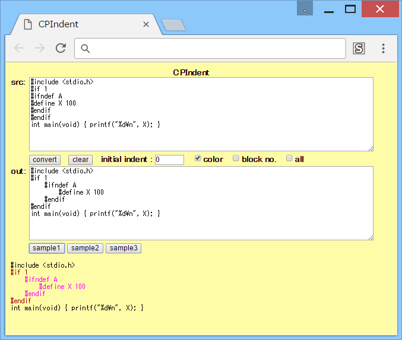

# CPIndent

## 概要
- Cプリプロセッサの命令のインデント変換を行うHTMLです。

- C のプログラム内で、Cプリプロセッサの命令は、通常 インデントされないため、  
  `#if` 等の適用範囲が分かりにくい場合があります。  
  本アプリは、この適用範囲を分かりやすく確認するための簡易ツールです。  
  (基本的に確認専用です)

- 実行例は、以下のページにあります。  
  https://hamayapp.appspot.com/static/cpindent.html

## 使い方
- cpindent.html を ブラウザで開くと起動します。

- srcのテキストボックスに C のプログラムを貼り付けて、  
  convertボタンをクリックすると、Cプリプロセッサの命令のインデント変換を実行します。  
  結果は、outのテキストボックスに表示されます。  
  また、その下にはブロックごとに色分けした結果も表示されます。

- initial indentのテキストボックスに数値を入力すると、変換時の初期インデント量を設定できます。

- また、colorのチェックボックスのチェックを外すと、色を付けなくなります。

- また、block no.のチェックボックスにチェックを入れると、# のところにブロックの番号を表示します。  

- また、allのチェックボックスにチェックを入れると、C のプログラムも全てインデントします。  
  チェックを入れなければ、Cプリプロセッサの命令のみインデントします。

- clearボタンをクリックすると、入出力をすべてクリアします。

- sample1-3ボタンをクリックすると、変換の例を表示します。

- 変換を実行しても変化がなかった場合には [ no change ] と表示します。

## 注意事項
1. インデントの単位は、半角スペース4個に固定です。

2. インデント変換は半角スペースを追加するのみであるため、  
   元々変なインデントになっている場合には うまく整形できません。

## 環境等
- OS
  - Windows 8.1 (64bit)
- ブラウザ
  - Chrome v55

## 履歴
- 2017-1-9   v1.00 (初版)
- 2017-1-9   v1.01 allのチェックボックス追加

(2017-1-9)
